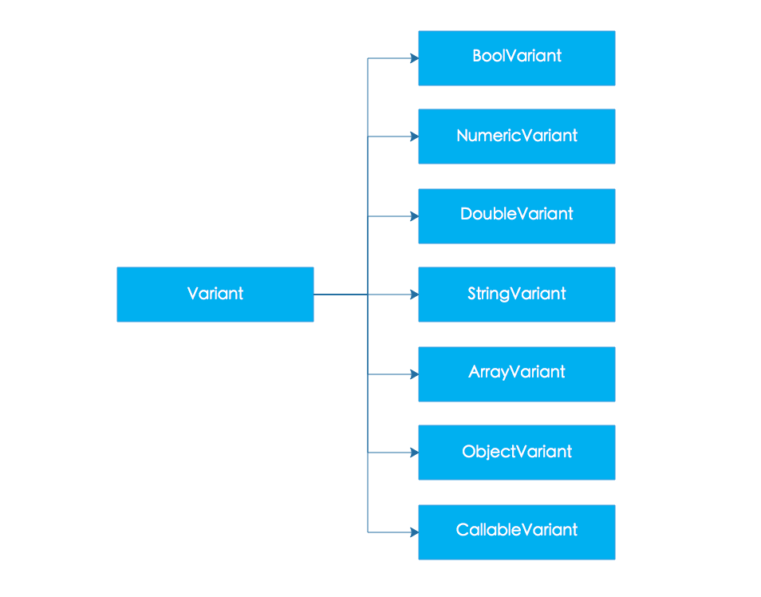

`PHP`虽然是弱类型的语言，但是底层的变量还是有类型的，在`Zend Engine`引擎中常用的类型大概有如下的几种：
1. `IS_UNDEF`
2. `IS_NULL`
3. `IS_FALSE`
4. `IS_TRUE`
5. `IS_LONG`
6. `IS_DOUBLE`
7. `IS_STRING`
8. `IS_ARRAY`
9. `IS_OBJECT`
10. `IS_CONSTANT`

在`Zend Engine`对所有的类型都是用同一个结构体进行表示的，这个结构体就是大名鼎鼎的`_zval_struct`，以下就是他的定义代码：(`PHP 7.1.5`)
```c
struct _zval_struct {
	zend_value        value;
	union {
		struct {
			ZEND_ENDIAN_LOHI_4(
				zend_uchar    type,
				zend_uchar    type_flags,
				zend_uchar    const_flags,
				zend_uchar    reserved)
		} v;
		uint32_t type_info;
	} u1;
	union {
		uint32_t     next;
		uint32_t     cache_slot;
		uint32_t     lineno;
		uint32_t     num_args;
		uint32_t     fe_pos; 
		uint32_t     fe_iter_idx;
		uint32_t     access_flags;
		uint32_t     property_guard;
		uint32_t     extra;
	} u2;
};
```
这个结构体最重要的两个字段`value`和`u1`, `value`保存变量的值, `u1`这个联合体保存了变量的类型数据。
下面我们分析下 `zend_value`联合：
```c
typedef union _zend_value {
	zend_long         lval;
	double            dval;
	zend_refcounted  *counted;
	zend_string      *str;
	zend_array       *arr;
	zend_object      *obj;
	zend_resource    *res;
	zend_reference   *ref;
	zend_ast_ref     *ast;
	zval             *zv;
	void             *ptr;
	zend_class_entry *ce;
	zend_function    *func;
	struct {
		uint32_t w1;
		uint32_t w2;
	} ww;
} zend_value;
```
一目了然，`PHP`支持的所有类型都是由它表示，当我们在`PHP`中定义变量时候，底层都会生成相应的结构体，很简单吧。我们上大学的时候在计算机课程中都知道，程序是数据结构和定义在数据结构上的操作组成。
`Zend Engine`中针对各种支持的类型定义了很多操作宏, 比如就有如下的宏定义：
1. `Z_TYPE(zval);` 获取变量类型
2. `ZVAL_NEW_STR(z, s);` 生成一个全新的字符串
3. `ZVAL_LONG(z, l);` 将整型数据存入变量
4. `Z_STRLEN(zval);` 获取保存在变量中的字符串的长度信息
5. ...

`PHP`源码树中的`Zend/zend_types.h`文件中定义了非常的操作变量的宏，大家有兴趣可以自己去研究。

其实说道这里，其实问题就出来了，比如:
1. 各种操作宏函数类型不安全，容易出现问题
2. 操作简单类型比如数值型，布尔还行，操作数组或者字符串的话就有点复杂了, 比如在处理字符串拼接时候就比较麻烦。
3. 代码中各种宏调用，非常不优美
4. 需要自己管理引用计数，非常容易忘记从而导致内存泄露

为了解决以上的问题，`zendAPI`将`Zend Engine`底层的操作数据类型的接口进行抽象，对常见的几种数据类型进行封装，为扩展开发者提供了一套面向对象的数据类型。


#### zapi::ds::Variant

通用类型容器类，这个类就像他的名字一样，提供了所有`Zend Engine`支持的类型的构造函数，是具体类型的基类，负责在`zendAPI`和`Zend Engine`之间进行数据传递。这个类不提供具体跟类型相关的方法，如果需要操作特定类型的变量，请使用下面的特定类型的封装类。
这个类提供了一些实用的功能，比如获取变量的类型，判断两个变量是否相等已经向一些常见类型的类型转换方法等等。

> [zapi::ds::Varaint 详细使用文档](../commondatastureentry/generalvarwrapper.html)
> [zapi::ds::Variant 参考手册](/api/classzapi_1_1ds_1_1_variant.html)

#### zapi::ds::BoolVariant

这个类型主要在`zapi::ds::Variant`的基础上提供了布尔数据类型相关的操作方法，最重要的就是两个类型转换方法：
```cpp
virtual bool toBool() const ZAPI_DECL_NOEXCEPT override;
operator bool () const override;
```
这样`zapi::ds::BoolVariant`就能跟普通的`C++`布尔类型一样用在`if`，`while`等等条件判断上下文中了。

> [zapi::ds::BoolVariant 详细使用文档](../commondatastureentry/boolvariantwrapper.html)
> [zapi::ds::BoolVariant 参考手册](/api/classzapi_1_1ds_1_1_bool_variant.html)

#### zapi::ds::NumericVariant

这个类型主要在`zapi::ds::Variant`的基础之上提供了数值类型的操作方法比如四则运算，比较大小以及自增和自减运算等等，基本能达到类似`C++`原生整型的水平。

> [zapi::ds::NumericVariant 详细使用文档](../commondatastureentry/numericvariantwrapper.html)
> [zapi::ds::NumericVariant 参考手册](/api/classzapi_1_1ds_1_1_numeric_variant.html)

#### zapi::ds::DoubleVariant

这个类型主要在`zapi::ds::Variant`的基础之上提供了浮点类型的操作方法比如四则运算，比较大小以及与整型混合计算的类型提升模拟等等，基本能达到类似`C++`原生浮点类型的水平。

> [zapi::ds::DoubleVariant 详细使用文档](../commondatastureentry/floatvariantwrapper.html)
> [zapi::ds::DoubleVariant 参考手册](/api/classzapi_1_1ds_1_1_double_variant.html)

#### zapi::ds::StringVariant

这个类型主要在`zapi::ds::Variant`的基础之上提供了字符串相关的操作方法，我们实现字符串接口的时候参考了`std::string`接口和`Qt`里面的`QString`的接口，提供了如下常见的接口方法：
1. 字符串长度自增管理
2. 字符串拼接
3. 子串的获取
4. 子串的查找
5. 删除特定子串
6. 首尾添加字符串
7. 任意位置插入子串

通过提供的这些功能接口，简化了开发扩展的时候对于字符串操作的难度。我们在这里只是概要的说明一下，具体的详细使用教程，大家可以参考下面两个链接:

> [zapi::ds::StringVariant 详细使用文档](../commondatastureentry/stringvariantwrapper.html)
> [zapi::ds::StringVariant 参考手册](/api/classzapi_1_1ds_1_1_string_variant.html)

#### zapi::ds::ArrayVariant

这个类型主要在`zapi::ds::Variant`的基础之上提供了数组操作的相关方法，虽然我们在`PHP`代码中使用我们的数组那是一个爽字了得，基本绝大部分程序没有数组是万万不行的。但是，您如果写扩展的话，在`C/C++`语言环境中对数组进行操作，特别是数字索引和字符串索引相互嵌套的时候，那是相当酸爽，你懂得。
为了克服以上的痛点，我们在实现数组接口的时候尽量在`C++`类型系统的限制内模拟`PHP`中数组的操作方法，同时在设计接口的时候借鉴了`std::map`和`QHash`等等程序类的接口。我们大致提供了一下的常用接口方法：
1. 不限维度数组嵌套，而且是动态生成
2. 数字索引与字符串索引随便嵌套，随心所欲
3. 数组项支持所有`Zend Engine`支持的数据类型
4. `C++`方式的迭代器支持
5. 友好的插入与删除数据项支持

我们在这里只是简单的介绍了一下`zapi::ds::ArrayVariant`的特性，是不是感觉很爽，想知道详细的使用文档的话，请您点击查看下面的链接:

> [zapi::ds::ArrayVariant 详细使用文档](../commondatastureentry/arrayvariantwrapper.html)
> [zapi::ds::ArrayVariant 参考手册](/api/classzapi_1_1ds_1_1_array_variant.html)

#### zapi::ds::ObjectVariant

这里类型主要在`zapi::ds::Variant`的基础之上提供了描述`PHP`中对象的相关接口，为什么需要这个类呢？因为有的时候我们需要在`C++`空间实例化一个自定义的原始类，这个时候我们这个类就派上用场了，方便我们在参数中传递对象。
提供的常见接口有：
1. 属性获取接口
2. 方法调用接口
3. instanceOf 接口

具体的用法请大家点击下面的链接详细了解：

> [zapi::ds::ObjectVariant 详细使用文档](../commondatastureentry/objectvariantwrapper.html)
> [zapi::ds::ObjectVariant 参考手册](/api/classzapi_1_1ds_1_1_object_variant.html)

#### zapi::ds::CallableVariant

这个类型主要在`zapi::ds::Variant`的基础上提供了描述可调用实体的相关接口，当我们的原生定义的函数或者方法的参数有闭包或者函数的时候，我们必须借助这个类型进行传递。
主要就是提供了函数调用运算符重载：
```cpp
Variant operator ()() const;
template <typename ...Args>
Variant operator ()(Args&&... args);
```
具体的使用范例，请参考下面的两个链接：

> [zapi::ds::CallableVariant 详细使用文档](../commondatastureentry/functionvariantwrapper.html)
> [zapi::ds::CallableVariant 参考手册](/api/classzapi_1_1ds_1_1_callable_variant.html)

写在最后的话，关于`PHP`变量大家可以阅读以下两篇文章，写的非常不错：
> [Internal value representation in PHP 7 - Part 1](https://nikic.github.io/2015/05/05/Internal-value-representation-in-PHP-7-part-1.html)
> [Internal value representation in PHP 7 - Part 2](https://nikic.github.io/2015/06/19/Internal-value-representation-in-PHP-7-part-2.html)