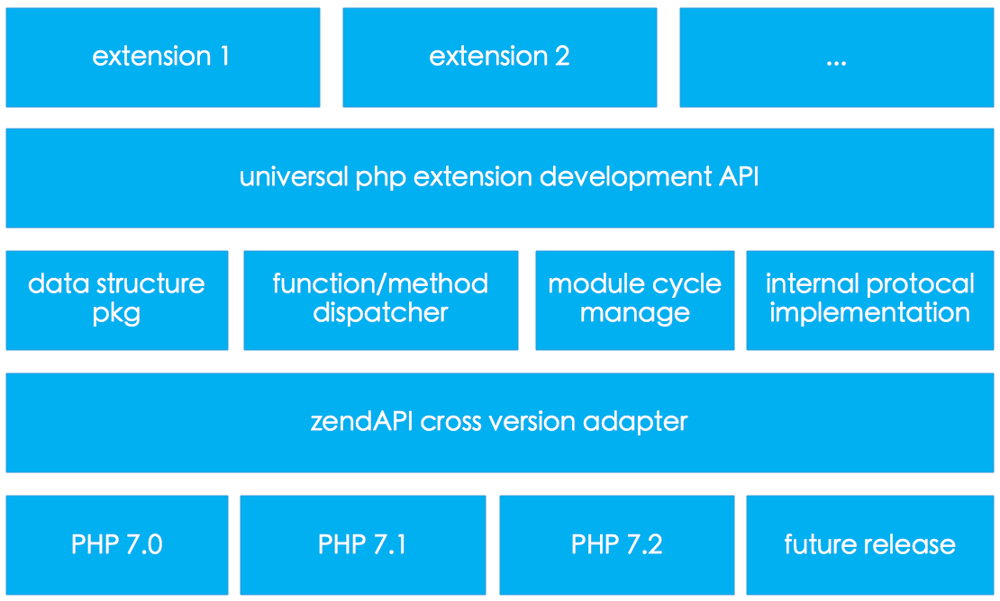
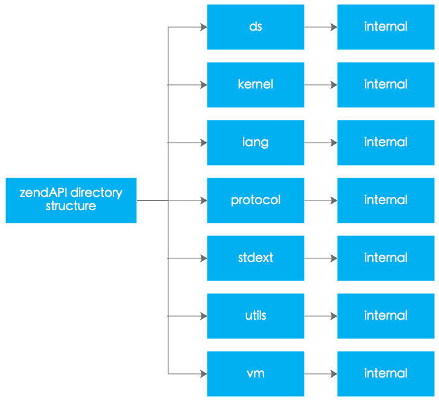

`zendAPI`是个很小的项目，整体的结构也很简单，主要分为以下几个部分：
1. 与`Zend Engine`底层整合的部分
2. 语言结构元信息定义部分
3. 常用数据结构和常用工具函数封装部分

当我们基于`zendAPI`进行`PHP`扩展开发的时候主要使用的是语言结构元信息定义部分和常用数据结构和常用工具函数封装部分。
不多说，我们直接放图：

### 子模块的简明描述

#### zendAPI cross version adapter
`PHP`跨版本兼容适配层，这个模块的作用为屏蔽`PHP`不同版本间的一些数据结构或者函数接口之间的差异性，为`zendAPI`实现跨版本兼容提供坚实的基础。

#### data structure pkg
这个模块主要对`PHP`语言的常用数据结构的操作接口进行封装，我们目前封装的数据结构有:
1. 通用变量容器 (`zapi::ds::Variant`)
2. 字符串 (`zapi::ds::StringVariant`)
3. 数组 (`zapi::ds::ArrayVariant`)
4. 整型 (`zapi::ds::NumericVariant`)
5. 布尔型 (`zapi::ds::BoolVariant`)
6. 对象类型 (`zapi::ds::ObjectVaraint`)
7. 函数闭包类型 (`zapi::ds::FunctionVaraint`)

在我们定义原生函数或者原生的时候，进行参数传递和返回值定义的时候必须使用以上我们封装的数据类型。

#### function & method dispatcher
这个模块主要作用是将`PHP`脚本中对函数或者类的方法的调用请求重新派发到基于`zendAPI`开发的原生`CPP`函数和原生`CPP`类的方法上，放置调用的参数，以及将返回值传递回`Zend Engine`。

#### module cycle manage
`PHP`解释执行的时候有严格的初始化和销毁流程，这个模块主要是让基于`zendAPI`开发的扩展具备设置特定的初始化或者销毁事件的处理钩子函数，方便我们的扩展在启动或者销毁阶段进行一些处理，加入自己的初始化和资源清除处理函数。

#### internal protocal implementation
这个模块主要是实现一些`PHP`内部使用的一些接口，比如迭代器(Iterator)，可数接口(Countable), 数组运算符重载(ArrayAccess)以及序列化(Serializable)。

#### universal php extension development API
这个模块提供最基本的扩展开发接口，比如如何定义常量，函数，类等等语言结构，我们使用`CPP`开发的模块实现的功能，必须使用这个模块的接口与`Zend Engine`进行整合。
我们提供的接口有:
1. zapi::lang::Extension
2. zapi::lang::Constant
3. zapi::lang::Method
4. zapi::lang::Class
5. zapi::lang::Argument
6. zapi::lang::Interface

...

> 更多的接口请大家查看：命名空间 [zapi::lang](/api/namespacezapi_1_1lang.html)

### 项目文件系统结构描述
为了便于大家分析和使用`zendAPI`项目，我们对项目的文件夹结构按照功能的模块进行了相应的组织。

#### 子文件夹作用描述

#### ds

这个文件夹存放实现`PHP`常见的数据结构封装相关的文件。

#### kernel

这个文件夹存放一些核心类和函数封装的文件。

#### lang

这个文件夹存放语言元信息定义的相关类的实现文件，比如扩展，类，函数等等元信息。

#### stdext

这个文件夹存放我们对标准库扩展的一些文件，为什么要去扩展标准库呢？因为我们使用的`CPP`语言规范起点是`C++11`标准，但是有些特性只有在`C++14`和`C++17`才出现，但是我们需要用到，解决方法就是我们自己实现一个版本。

#### utils

这个文件夹存放一些工具类和常用的一些函数的定义文件。

#### vm

这个文件夹存放所有跟`Zend Engine`有关系的类和函数的定义文件，属于内部封装，一般开发扩展不需要了解这个里面的类或者函数。

#### internal

大多数子文件夹里面都有这个子文件件，这个文件夹里面存放相应的私有实现类定义文件，尽最大可能提供二进制兼容，为了实践`impl idiom`设计模式。
